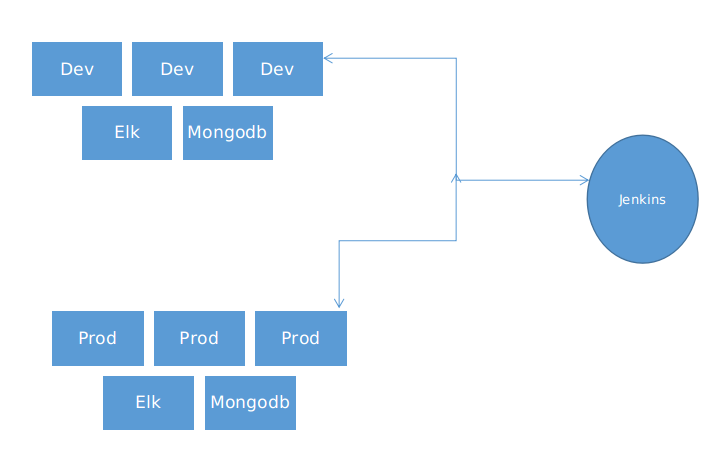
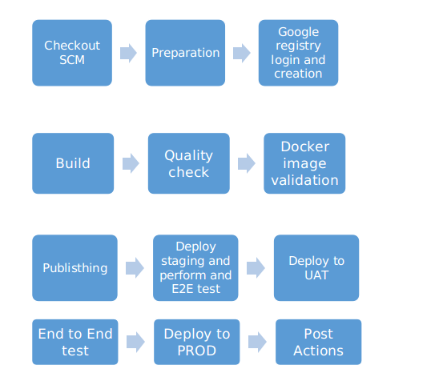
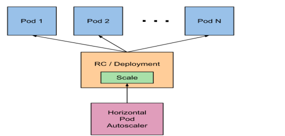

Infrastructure and Deployment details

Complete architecture definition

1.I will be using Google Cloud Platform as a cloud services.
   
   Reasons: 1. Less expensive
             2. They provide GKE (Google K8s Engine) which supports container format and fully managed services. 

2.Deployment side there are 2 options we have 1. Jenkins and 2. GitHub. But I prefer to use Jenkins. As Jenkins is open source and easy to integrate with kubernetes for deploying images.

3.Prometheus and Grafana will be using for monitoring. As it would give complete graph and spikes occurred clearly. 

4.For logging will be using Elasticsearch, Logstash and Kibana. As Logstash will collect the data and events. Also parses and transform it. Elasticsearch gets its stored and indexed. Kibana will be giving visualization for those logs.

5.Services we will be using from GCP are API gateway, OAuth, Redis, RabbitMQ.

6.MongoDB will be using as the database. As it provide high data storage with easy retrieval. Also powerful query analytics. 

Incase of MongoDB we can create a stateful set with persistent volume or can use Mongodb Atlas. MongoDB Atlas should be preferred as it is fully manages and data protection will be there. Also it is not free. 

7.Need to have GIT and Docker repo(to keep images).

8.Need to google cloud registry to keep the images and also attaching a policy to remove old images to reduce the cost.

Working structure

How Deployment works

1.Integrate the Jenkins with GIT repo using GIT parameter and credentials. We can do auto deployment also as when a code merge is happened will deploy automatically. Instead of that I prefer to have different branches for each Environment. We can enable choice parameter in Jenkins so that we can define enter GIT branch details during runtime. 

2.Whenever a deployment is triggered will login into GCP registry or creates if its not there. Then starts to build the Dockerfile or docker-compose file we defined in GIT repo.

3.After building the docker images doing a quality check whether the images is matching all the requirements. If it satisfies will create a tag with latest deployment and stores in registry. 

4.Then the image will get publish and deployed to staging environment.

5.Here in staging it will perform first end to end test and all the API testing.

6.It its working fine will move to UAT and then to production. Will be enable old images deletion settings on Google registry. So that unwanted images will be removed.

7.So to avoid further complication need to create a docker hub so that older images after getting removed from GCP will be stored here. Also we can enable venerability check on docker hub to keep our images clean.

These are the complete CI/CD process.

The Application details in our structure.

1. User Interface
  
Code is deployed using Jenkins and using Nginx Ingress controller will be able to provide the UI. Here will be using Node js. As GCP provides OAuth security using Node.js

2.API Gateway
  
GCP provide fully manages API Gateway services. API Gateway enables you to provide secure access to your backend services through a well-defined REST API that is consistent across all of your services, regardless of the service implementation. Clients consume your REST APIS to implement standalone apps for a mobile device or tablet, through apps running in a browser, or through any other type of app that can make a request to an HTTP endpoint.

3.OAuthorization Server
 
 
 
GCP uses OAuth 2.0. Working of OAuth

4.Long Running Jobs

We can write a yaml file using kind job for cron or jobs. Attaching a sample job file.

5.For Queues we are using RabbitMQ which is also GCP provided services.

6.For cache storage we can enable redis service which is also provided by GCP or we can create a redis using yaml.

7.If we are coming to database I prefer to use MongoDB. For larger query and size Mongodb is much preferred.  For easy management we can MongoDB Atlas as it is fully managed service.

Horizontal Pod Autoscaler

  We can do autoscaling based on resource’s utilization as percentage by specifying value for CPU requests.  If we do not specify requests, you can autoscale based only on the absolute value of the resource's utilization, such as milliCPUs.  
