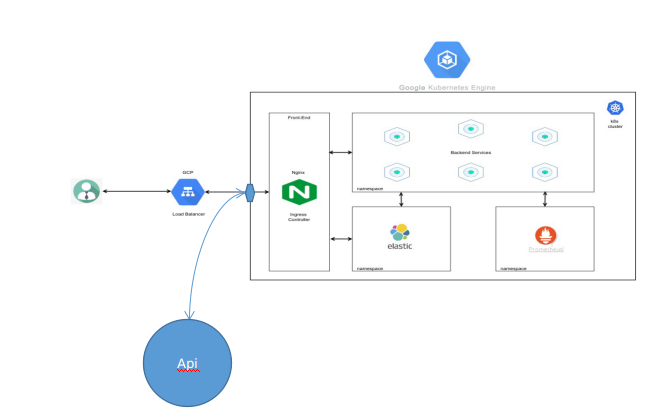

Basic Architecture

Backened Architecture

Simple Diagram to show the architecture of backened. 

Tools we are using in structure.

Cloud services: Google Cloud Platform

Microservices: Kubernetes ( Google Kubernetes Engine)

Deployment: Jenkins

Database: MongoDB Atlas

Monitoring: Prometheus and Grafana

Logging: ElasticSearch, Logstash and Kibana

Webserver: Nginx

Services using: Redis, API Gateway, OAuth 2.0
